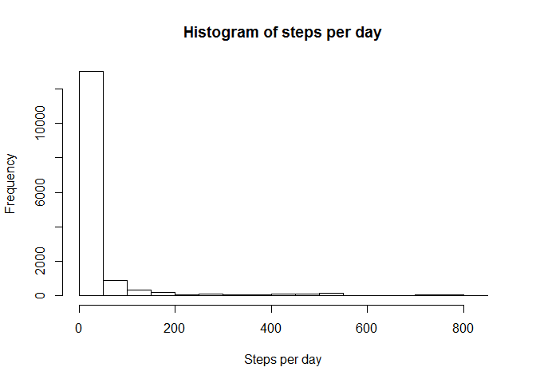
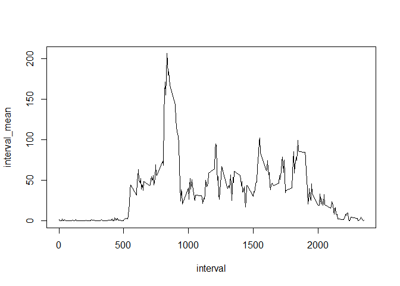
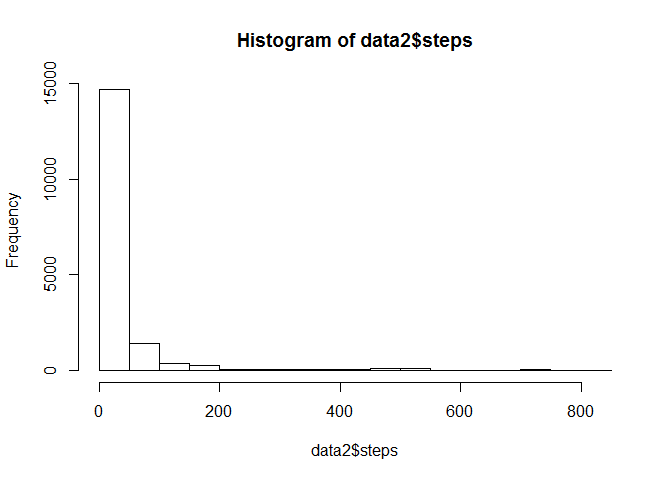
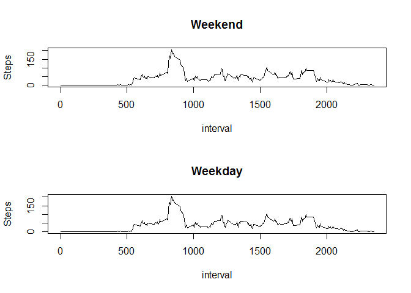

# Reproducible Research: Peer Assessment 1


## Loading and preprocessing the data

After unzipping the CSV file, it is read into R with headers


```r
data <- read.csv(".//activity.csv", header = T)
```


There are three names for the data:


```r
names(data)
```

```
## [1] "steps"    "date"     "interval"
```

Convert the *date* column into POSIX dates


```r
data$date <- as.Date(data$date, "%Y-%m-%d")
```

## What is mean total number of steps taken per day?

```r
hist(data$steps, main = "Histogram of steps per day", xlab = "Steps per day", ylab = "Frequency")
```

 

Calculate the mean of the steps per day (excluding NA values):

```r
mean(data$steps, na.rm = TRUE)
```

```
## [1] 37.3826
```

Calculate the median of the steps per day (excluding NA values):

```r
median(data$steps, na.rm = TRUE)
```

```
## [1] 0
```

## What is the average daily activity pattern?

There are 61 days in the activity.csv file. The goal for this section to to find the mean for each time interval over the 61 days and plot them on one graph.

The *interval* variable is captured every 5 minutes of the day, starting at 0 (12:00 midnight), and ending at 2355 (11:59 PM).

The value for 1:00 AM is 100, not 60, so simple multiplication cannot convert *interval* into time.

I dedicded to pull out all the values of *interval*


```r
interval <- unique(data$interval)
```

I then intialized a sequence to use as a holder in calculating the mean number of steps.


```r
interval_mean <- seq(length(interval))
```


Running through a for loop, I subset all of the steps with the same interval measure and calculated the mean. NA values were removed:


```r
for (i in 1:length(interval)) {
     interval_mean[i] <- mean(subset(data$steps, data$interval == interval[i]), na.rm = TRUE)
}
```

A line plot compares the average steps versus the time of day.


```r
plot(interval, interval_mean, type = "l")
```

 

To find the most active time of the day based on the average, I searched for the highest mean (maximum interval_mean) and referenced the original interval array

```r
interval[which(interval_mean == max(interval_mean))]
```

```
## [1] 835
```

The most active time of the day, on average, was 8:35 AM.

## Inputing missing values

Calculate the number of NA values in the data frame:


```r
sum(is.na(data))
```

```
## [1] 2304
```

To remove NA values, I will create a duplicate of the original data frame, named **data2**.


```r
data2 <- data
```

Looping through the new data frame, I will check to see if the *steps* variable is NA. If it is, fill it in with the average for that observations *interval*.


```r
for (i in 1:nrow(data2)) {
     if (is.na(data2$steps[i] == TRUE)) {
     data2$steps[i] <- interval_mean[which(interval == data[i,3])]
     }
}
```

Plotting the number of steps on a histogram:


```r
hist(data2$steps)
```

 

Comparing the value of the original dataset mean with the new dataset mean shows that they are the same.


```r
mean(data$steps, na.rm = TRUE) ## Original data set mean
```

```
## [1] 37.3826
```

```r
mean(data2$steps) ## NA replaced dateset
```

```
## [1] 37.3826
```

The same also goes for the median:


```r
median(data$steps, na.rm = TRUE) ## Original data set median
```

```
## [1] 0
```

```r
median(data2$steps) ## NA replaced dateset
```

```
## [1] 0
```
## Are there differences in activity patterns between weekdays and weekends?

Sort data into *weekend* and *weekday* factors


```r
for (i in 1:nrow(data)) {
     if (weekdays(data$date[i]) == "Saturday" | weekdays(data$date[i]) == "Sunday") {
          data$Day[i] <- "Weekend"
     }
     else {
          data$Day[i] <- "Weekday"
     }
}
```

Factor out weekday/weekends


```r
data$Day <- factor(data$Day)
```

Initialize a variable to hold the mean for weekends and weekdays:


```r
interval_mean_weekend = seq(1:288)
interval_mean_weekday = seq(1:288)
```

Seperate out weekend and weekdays and calculate a mean number of steps for each 5-minute interval:


```r
## seperate out Weekend days and calculate a mean number of steps for each interval
for (i in 1:length(interval)) {
    interval_mean_weekend[i] <- mean(subset(data$steps, data$interval == interval[i]), na.rm = TRUE)
}


## seperate out weekday days and calculate a mean number of steps for each interval
for (i in 1:length(interval)) {
     interval_mean_weekday[i] <- mean(subset(data$steps, data$interval == interval[i]), na.rm = TRUE)
}
```

Plot the average number of steps for each interval over the 61 days.


```r
par(mfrow = c(2,1))
plot(interval, interval_mean_weekend, type = "l", main = "Weekend", ylab = "Steps")
plot(interval, interval_mean_weekday, type = "l", main = "Weekday", ylab = "Steps")
```

 
